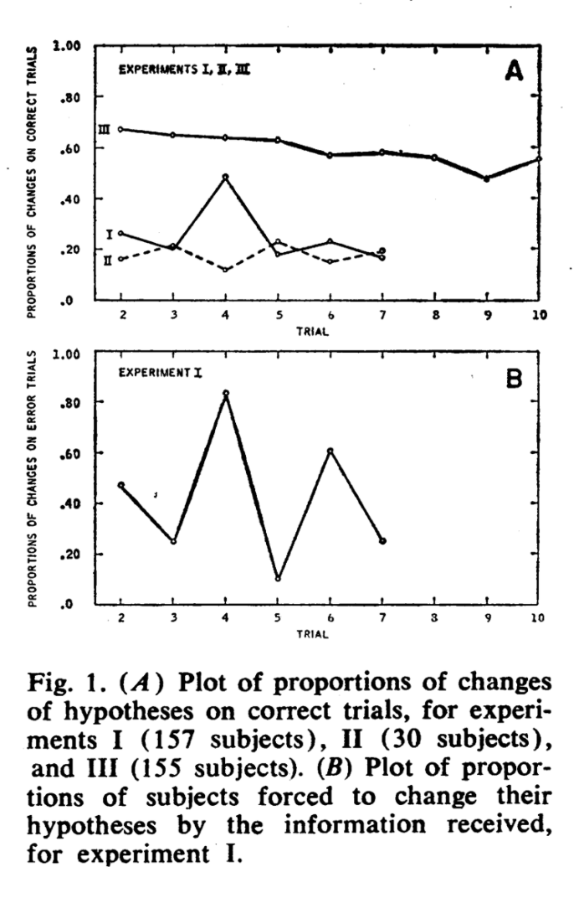

##Introduction

Suppes and Schlag-Rey (1965) examined whether, in a categorization task, people reclassify items following positive reinforcement, that is, evidence that their categories are already consistent with the true classification rule. The authors asked participants to sort cards containing patterns of letters into two categories ("blue" and "pink"). Then, one by one, the authors revealed the cards' true category labels, giving participants the opportunity to reclassify items after each such piece of feedback. A labeled example was considered to be positive reinforcement if the label agreed with the participant's existing classification, and negative reinforcement otherwise. Perhaps surprisingly, participants sometimes readjusted their categories following positive reinforcement.

While the authors report results from three related experiments, this replication study concerns the first, in which Suppes and Schlag-Rey asked N = 157 participants to categorize eight cards, and presented labeled examples in the same order across participants. The authors found that, for positive reinforcement trials, the mean proportion of category switches across participants and across trials was approximately 0.2. Although they noted a null hypothesis, that the proportion of switches would be 0, they did not report the results of any statistical tests. In the replication study, participants will perform a web-based version of the original task. This study will test whether the probability of switching across participants and across trials is significantly greater than a noise probability of switching (proportion = 0.05, the null hypothesis). If it is, this would confirm Suppes and Schlag-Rey's original finding that the proportion of switches under positive reinforcement is non-zero.

##Methods

###Power Analysis

Suppes and Schlag-Rey do not report an effect size, but note that the proportion of switches under positive reinforcement was roughly 0.2 in their sample of 157 participants. I determined a priori power for a one-tailed one-sample binomial test (difference from a constant) in which the null hypothesis is that there is a small noise probability of switching (proportion = 0.05), and the alternative hypothesis is that proportion = 0.2, per Suppes and Schlag-Rey's findings. To achieve 80% power, 33 instances of positive reinforcement are required. Since reinforcement type depends on a participant's prior classifications, there is no deterministic relationship between the number of participants and number of positive reinforcement instances, but assuming one instance of positive reinforcement per participant seems like a reasonable, if slightly conservative, estimate. On this analysis, then, 33 participants provides 81.94% power, and 50 participants yields 95.17% power. 

###Planned Sample

Participants in this study will be workers on Amazon's Mechanical Turk located in the United States, with an approval rating of at least 85%, who self-identify as being at least 18 years of age, a native English speaker, and not colorblind. Given course budget constraints, this study will run N = 33 participants, estimated to provide 81.94% power.

###Materials

Stimuli are white, blue, and pink cards containing patterns of letters (e.g. “DDK”, “DKK”, etc. — all triples composed of D’s and K's) and consistent with the rule used in the original study (that pink items are patterns ending with "DD" or "KK", whereas blue items are those ending with "DK" or "KD"). Unlike in the original study, in which physical notecards were used, cards are virtual, specified in JavaScript.

###Procedure	

This replication experiment will be conducted on Amazon's Mechanical Turk and will consist of two main parts: a web-based sorting task, and a brief demographics questionnaire.

The web-based sorting task will mimic the original experient: During the initial phase of the experiment ("initial classification"), participants will sort cards into two categories by dragging and dropping cards arranged in random order in the staging area ("starting configuration") into one of two category "bins" (sections of the screen, labeled "blue" and "pink"). 

During the second phase, in each of a series of trials, a white card will disappear and the pink or blue version of that card will appear in the staging area; the color of the card indicates the true category to which the pattern belongs. The participant will place it in the correct category bin. If the card's color (label) agrees with the participant's original classification of the white version of the card, this example will be considered positive reinforcement; if it disagrees, the example will be negative reinforcement. Next, the participant will have the option to reclassify as many cards as they wish, using the drag-and-drop interface. Trials will end once all of the original white cards have been replaced. Examples will appear in the same fixed order across participants as in the original experiment: DKD (blue), KKK (pink), DDD (pink), KDK (blue), DKK (pink), KDD (pink), DDK (blue), KKD (blue).

Following the starting configuration and initial classification, each trial will begin when the colored example is presented and end when the participant clicks a "Next" button. At the end of the trial, for every stimulus, we will record:

1. The (x, y) coordinates
2. The region of the sorting area that the card occupies ("blue" if it is in the blue category box, "pink", "staging" area if it is still in the staging area, or "ambiguous" if the stimulus straddles a boundary between these areas)
3. Whether it is in a different region than it was at the end of the previous trial

In addition, we will determine (A) if any cards switched categories from the previous trial, and (B) if the labeled (colored) card constituted positive or negative reinforcement. Reinforcement type is considered undefined if a participant placed the white card containing the pattern of letters in the example was in either the staging region or ambiguous in the prior trial.

Suppes and Schlag-Rey do not provide details about the original task instructions. Given this, we created what we believe are reasonable instructions: participants will be aware that there exists some rule distinguishing the two categories, and that their job is to guess which cards belong to which categories. We encourage participants to take their time, indicating "we would rather that you think hard about your guesses than make them quickly". We hope that this instruction will encourage participants to reclassify cards as appropriate rather than rushing through the task.

A demo of this experiment, created largely with custom code building on the JsPsych JavaScript library, is at: https://web.stanford.edu/~hermannk/251/SuppesSchlagRey1965/oed/experiment/main.html (requires Chrome or Firefox browser)

###Analysis Plan

In this study, we will determine the proportion of reclassifications (mean proportion of reclassifications across trials and across participants), as done in the original study. We will then perform a one-tailed, one-sample exact binomial test to determine if the observered proportion (our alternative hypothesis) is significantly greater than 0.05 (the null hypothesis, representing a small noise probability).

In exploratory analyses, we will visualize the distribution of individual participants' proportions of switches, plot the proportion of switches as a function of trial (similar to Figure 1 in Suppes and Schlag-Rey 1965), and determine whether the observed proportion of switches on negative reinforcement trials is significantly greater than 0.05.

###Differences from Original Study

The original study participants were college students in the 1960s, whereas in this replication, participants will be workers on Mechanical Turk likely to be more diverse in demographics.

The original study did not specify exclusion criteria. However, one worry about a web-based replication is that participants may not be motivated to reclassify cards when given the opportunity to do so following examples, wishing instead to complete the experiment as quickly as possible, and thus skipping this crucial step. To guard against this, a participant will be excluded if they meet any of the following conditions:

1. Make any "ambiguous" card placements (card straddles multiple regions, e.g. category boxes and/or staging area).

2. Reinforcement type is "undefined" for any trials (previous categorization was either "staging" or "ambiguous").

3. Reclassify cards 0% of the time. Failure to reclassify cards on at least some negative reinforcement trials demonstrates a basic lack of effort on the task.

4. Less than 87.5% correct on final classification, indicating failure to follow instructions to drag colored cards into appropriate category box.

Whereas the original study was performed in person using physical notecards, we have adapted the experiment to a web-based format that we believe preserves the important aspects of the original task.

```{r include=F}
###Data Preparation

####Load Relevant Libraries and Functions
library(jsonlite)
library(dplyr)
library(ggplot2)
library(binom)
library(lme4)

####Import data

# data has already been minimally preprocessed (converted from csv to json, and json cleaned up, using the python script process_csvs.py)
data_path <- paste0(getwd(), "/anonymized-results/")
files <- dir(data_path, pattern = "*.json")
d.raw <- data.frame()
problem_report <- data.frame()
for (f in files) {
  jf <- paste0(data_path,f)
  
  participant <- fromJSON(jf)
  participant_data <- participant$Data
  participant_data$workerid <- participant$HITInfo$WorkerId
  participant_data$gender <- participant$Demographics$Gender
  participant_data$age <- participant$Demographics$Age
  participant_data$education <- participant$Demographics$Education
  problem_report <- bind_rows(participant$ProblemReport)
  d.raw <- bind_rows(d.raw, participant_data)
}

# Number of participants
original_num_participants = length(unique(d.raw$workerid))

#### Preprocess

# convert dtype
d <- d.raw
d[sapply(d, is.character)] <- lapply(d[sapply(d, is.character)], as.factor)

#### Data exclusion / filtering

# Check exclusion criteria
excluded = c()
exclusion_reasons = c()
for (worker in levels(d$workerid)) {
  worker_data <- d %>% filter(workerid == worker)
  
  # Exclusion criterion 1: Any card placements are "ambiguous"
  if (sum(worker_data$num_ambiguous_placements) > 0) {
    excluded <- c(excluded, c(worker))
    exclusion_reasons <- c(exclusion_reasons, c("Exclusion1"))
  }
  
  # Exclusion criterion 2: Any reinforcements are "undefined"
  undefined_reinforcements <- worker_data %>% 
    filter(reinforcement == 'undefined') %>%
    NROW()
  if (undefined_reinforcements > 0) {
    excluded <- c(excluded, c(worker))
    exclusion_reasons <- c(exclusion_reasons, c("Exclusion2"))
  }
  
  # Exclusion criterion 3: Reclassify cards 0% of the time
  num_trials_with_any_reclassification <- worker_data %>% 
    filter(any_reclassifications == TRUE) %>%
    NROW()
  if (num_trials_with_any_reclassification == 0) {
    excluded <- c(excluded, c(worker))
    exclusion_reasons <- c(exclusion_reasons, c("Exclusion3"))
  }
  
  # Exclusion criterion 4: Less than 87.5% correct on final classification
  final_classifications <- worker_data %>%
    filter(trial == '7')
  num_correct_final <- sum(
        (final_classifications$im0_colored_region == 'blue') & 
        (final_classifications$im1_colored_region == 'pink'),
        (final_classifications$im2_colored_region == 'pink'),
        (final_classifications$im3_colored_region == 'blue'),
        (final_classifications$im4_colored_region == 'pink'),
        (final_classifications$im5_colored_region == 'pink'),
        (final_classifications$im6_colored_region == 'blue'),
        (final_classifications$im7_colored_region == 'blue'))
  if (num_correct_final < 7) {
    excluded <- c(excluded, c(worker))
    exclusion_reasons <- c(exclusion_reasons, c("Exclusion4"))
  }
}
# clean up workspace
rm(participant, participant_data, worker, worker_data, num_correct_final, num_trials_with_any_reclassification, final_classifications)

# remove excluded participants
print(paste0('Excluding ', length(excluded), ' participants because: '))
print(exclusion_reasons)
d_pre_exclusion <- d
for (worker in excluded) {
  d <- d[d$workerid != worker,]
}
# Number of participants post-exclusion
num_participants = length(unique(d$workerid))
num_exclusions = length(unique(excluded))

#### Prepare data for analysis - create columns etc.
positive_reinforcement_trials <- d %>%
  filter(reinforcement == 'positive', 
         trial != '7') # don't include final trial in the analysis, since this is the solution state: all colored cards have been placed

negative_reinforcement_trials <- d %>%
  filter(reinforcement == 'negative',
         trial != '7')

#### Utils
# one-sample binomial test
binom_test <- function(num_successes, n) {
  return (binom.test(x = num_successes, 
                     n = n, # num trials
                     p = 0.05, # alternative hypothesis
                     alternative = c("greater"))) # also returns one-tailed 95% CIs
}

# calculate 95% CIs around proportions of switches by trial for later figures
compute_cis_by_trial <- function(reinforcement_type_trials) {
  cis_lower <- c()
  cis_upper <- c()
  for (i in (0:7)) {
    instances_this_trial = reinforcement_type_trials[reinforcement_type_trials$trial == toString(i),]$any_reclassifications
    if (length(instances_this_trial) > 0) {
      x <- sum(instances_this_trial)
      n <- length(instances_this_trial)
      cis_lower <- c(cis_lower, binom.confint(x, n, conf.level = 0.95, methods=c("exact"))$lower) # two-sided 95% CIs
      cis_upper <- c(cis_upper, binom.confint(x, n, conf.level = 0.95, methods=c("exact"))$upper)
    }
  }
  cis_packed <- list("lower" = cis_lower, "upper" = cis_upper)
  return (cis_packed)
}

#### Prepare data for exploratory analyses
cis_by_trial_positive_reinforcement <- compute_cis_by_trial(positive_reinforcement_trials)
cis_by_trial_positive_reinforcement_lower <- cis_by_trial_positive_reinforcement$lower
cis_by_trial_positive_reinforcement_upper <- cis_by_trial_positive_reinforcement$upper

cis_by_trial_negative_reinforcement <- compute_cis_by_trial(negative_reinforcement_trials)
cis_by_trial_negative_reinforcement_lower <- cis_by_trial_negative_reinforcement$lower
cis_by_trial_negative_reinforcement_upper <- cis_by_trial_negative_reinforcement$upper

# prepare for plot
summary_positive <- positive_reinforcement_trials %>%
        group_by(trial) %>% 
        summarise(prop_switches = sum(any_reclassifications)/length(any_reclassifications))
summary_positive$reinforcement = 'positive'
summary_positive$cis_lower = cis_by_trial_positive_reinforcement_lower
summary_positive$cis_upper = cis_by_trial_positive_reinforcement_upper
summary_negative <- negative_reinforcement_trials %>%
        group_by(trial) %>% 
        summarise(prop_switches = sum(any_reclassifications)/length(any_reclassifications))
summary_negative$reinforcement = 'negative'
summary_negative$cis_lower = cis_by_trial_negative_reinforcement_lower
summary_negative$cis_upper = cis_by_trial_negative_reinforcement_upper
summary_proportions_by_trial <- rbind(summary_positive, summary_negative)

#### Sample characteristics
print('Sample characteristics: demographics')
gender <- d %>% 
  group_by(gender, workerid) %>%
  summarise(first=head(workerid,1)) %>%
  group_by(gender) %>%
  tally() %>%
  mutate(percent = n/sum(n))

education <- d %>% 
  group_by(gender, education) %>%
  summarise(first=head(workerid,1)) %>%
  group_by(education) %>%
  tally() %>%
  mutate(percent = n/sum(n))

age <- d %>% 
  group_by(gender, age) %>%
  summarise(first=head(workerid,1)) %>%
  group_by(age) %>%
  tally() %>%
  mutate(percent = n/sum(n))

knitr::kable(head(positive_reinforcement_trials))
knitr::kable(gender)
knitr::kable(age)
```

### Methods Addendum (Post Data Collection)

#### Actual Sample
  Our sample consisted of N = `r original_num_participants` participants, of which `r num_exclusions` were excluded according to the exclusion criteria outlined above, leaving N = `r num_participants` (19 Male, 7 Female). The ages of our participants differed from those in original study, in which all participants were college-aged: in our sample, 25% were 18-29 years old, 50% were 30-49 years old, and 25% were 50-64 years old; 0% were 65 or older. 

#### Differences from pre-data collection methods plan
  After exclusions, we obtained a sample size of N = `r num_participants` participants. On our a priori power analysis, we had determined that we would need 33 instances of positive reinforcement in order to achieve 81.94% power on our one-sample binomial exact test, and conservatively estimated that 33 participants would be required to obtain this number of positive reinforcement instances assuming one positive reinforcement instance per participant. In our actual sample, however, we obtained many more instances per participant, with a total of 99 instances of positive reinforcement in our N = `r num_participants` participants, and were therefore well above 80% power.

##Results
### Confirmatory analysis

```{r}
# Main analysis: Test whether switching on positive reinforcement trials is significantly above zero (really, a small noise probability)

# One-tailed, one-sample exact binomial test
# null hypothesis: p = 0.05 (small noise probability)
# alternative hypothesis: p = observed proportion of reclassifications (mean proportion reclassifications across trials across participants)

num_positive_reinforcement_trials <- NROW(positive_reinforcement_trials)
num_switches <- sum(positive_reinforcement_trials$any_reclassifications)

prop_switch_positive_reinforcement_trials <- num_switches/num_positive_reinforcement_trials

# two-sided 95% CIs on prop switches
lower_positive <- binom.confint(num_switches, num_positive_reinforcement_trials, conf.level = 0.95, methods=c("exact"))$lower
upper_positive <- binom.confint(num_switches, num_positive_reinforcement_trials, conf.level = 0.95, methods=c("exact"))$upper

print(paste0('Total # positive reinforcement trials across participants = ', num_positive_reinforcement_trials))
print(paste0('Prop switches = ', prop_switch_positive_reinforcement_trials))

binom_result <- binom_test(num_switches, num_positive_reinforcement_trials) # defined in Utils
p_positive <- binom_result$p.value
print('Positive Reinforcement Trials')
print(binom_result)
```

```{r, echo=FALSE, fig.cap="FIGURE A. Error bars indicate 95% confidence intervals"}
# Create plot showing this result
ggplot(data = data.frame(prop_switch_positive_reinforcement_trials, reinforcement_type="Positive"),
       aes(x = reinforcement_type, y = prop_switch_positive_reinforcement_trials)) + 
  geom_point() +
  geom_errorbar(aes(ymin=lower_positive, ymax=upper_positive), colour="gray", width=.1) +
  geom_point(size = 4) +
  ylim(0, 1) + 
  xlab("Trial Reinforcement Type") + 
  ylab("Proportion Switches") +
  ggtitle("Proportion category switches for positive reinforcement trials") + 
  ggthemes::theme_few()
```

### Exploratory analysis
```{r, echo=FALSE, fig.cap="FIGURE B. Error bars indicate 95% confidence intervals"}
# Exploratory Analysis 1: Plot proportion of switches by trial under positive versus under negative reinforcement, for comparison with Suppes and Schlag-Rey's Figure 1A
ggplot(data = summary_proportions_by_trial,
  aes(x = trial, y = prop_switches, group=1)) +
  facet_wrap(~reinforcement) +
  geom_errorbar(aes(ymin=cis_lower, ymax=cis_upper), colour="gray", width=.1) +
  geom_point(size = 4, color = "darkgreen") +
  geom_line(size = 1, color = "darkgreen") +
  ylim(0, 1) + 
  xlab("Trial") + 
  ylab("Proportion Switches") +
  ggtitle("Proportion category switches by reinforcement type") + 
  ggthemes::theme_few()
```

```{r, echo=FALSE, out.width = "400px", fig.cap="FIGURE C. Proportion category switches by reinforcement type, original study (for comparison with Figure B). Experiment I is the study we replicated. Reproduced from (Suppes & Schlag-Rey, 1965)."}

```

```{r echo=FALSE, fig.cap="FIGURE D."}
# Exploratory Analysis 2: Histogram of participant proportions for positive reinforcement trials
ggplot(data = positive_reinforcement_trials %>%
         group_by(workerid, any_reclassifications) %>% 
         group_by(workerid) %>%
         summarise(prop_switches = mean(any_reclassifications)),
       aes(x = prop_switches)) +
  geom_histogram() +
  scale_x_continuous(breaks = seq(0, 1, by = .1)) + 
  labs(x = 'Proportion Switches', y = 'Number of Participants', 
       title = 'Proportion Switches on Positive Reinforcement Trials') +
  ggthemes::theme_few()
```

```{r}
# Exploratory Analysis 3: Test whether switching on negative reinforcement trials is significantly above 0.05 (small noise probability)
num_negative_reinforcement_trials <- NROW(negative_reinforcement_trials)
num_switches_negative <- sum(negative_reinforcement_trials$any_reclassifications)

prop_switch_negative_reinforcement_trials <- num_switches_negative/num_negative_reinforcement_trials

# two-sided 95% CIs on prop switches
lower_negative <- binom.confint(num_switches_negative, num_negative_reinforcement_trials, conf.level = 0.95, methods=c("exact"))$lower
upper_negative <- binom.confint(num_switches_negative, num_negative_reinforcement_trials, conf.level = 0.95, methods=c("exact"))$upper

print(paste0('Total # negative reinforcement trials across participants = ', num_negative_reinforcement_trials))
print(paste0('Prop switches = ', prop_switch_negative_reinforcement_trials))

binom_result <- binom_test(num_switches_negative, num_negative_reinforcement_trials) # defined in Utils
p_negative <- binom_result$p.value
print('Negative Reinforcement Trials')
print(binom_result)
```

## Discussion

### Summary of Replication Attempt

In a study of N = `r num_participants` participants, we found that the proportion of reclassifications on positive reinforcement trials (N = `r num_positive_reinforcement_trials` positive reinforcement trials) was `r prop_switch_positive_reinforcement_trials` (95% CIs [`r lower_positive`, `r upper_positive`]). This proportion was not significantly greater than a small (0.05) noise probability of switching (p = `r p_positive`, one-sample exact binomial test, one-tailed). 

Although Suppes & Schlag-Rey did not report statistics in their 1965 paper, their central claim was that the proportion of switches on positive reinforcement trials was non-zero (and approximately 0.20). Because the original authors did not specify a statistical test, we were left with this decision. The original authors might have tested the alternative hypothesis that the proportion of switches was greater than 0; however, we felt that a more reasonable test was whether the proportion was greater than a 0.05 noise probability of switching. On the selected test, our proportion did not reach significance, and on this standard, the original finding did not replicate.

### Commentary

We might expect to find a small proportion of reclassifications on positive reinforcement in a case in which participants were failing to reclassify cards in general. However, consistent with Suppes and Schlag-Rey's finding for this reinforcement type, we found that the proportion of switches on negative reinforcement trials (proportion = `r prop_switch_negative_reinforcement_trials`, 95% CIs [`r lower_negative`, `r upper_negative`]) was significantly greater than a 0.05 noise probability, suggesting participants were engaged with the classification task.

Looking at the frequency distribution of participants' proportion switches on positive reinforcement trials (see Figure D), we see that the vast majority of participants never switched on these trials; a few participants who switched frequently were responsible for the overall proportion of switches that we observed.

In an effort to compare our by-trial switch proportions under each reinforcement condition to those presented in Suppes & Schlag-Rey (Figure C), we created Figure B above. However, an irregularity in the Suppes & Schlag-Rey figure made comparison of the by-trial pattern impossible: although there are 7 trials on which participants may reclassify cards in the experiment, Suppes & Schlag-Rey show the results for only 6 trials. Since they do not indicate which trial is missing, it isn't possible to determine the correspondence between the trial numbers on their x-axis and the trial numbers on ours.

A unique challenge in our replication effort was determining which instructions to give study participants: the original authors do not indicate how they framed the task. We chose to give the following set of instructions:

> In this task, we will show you some cards. Each card belongs to either a "PINK" category or a "BLUE" category according to some rule. Your job is to guess which cards belong to which categories.In the beginning, you will just have to guess. But as the experiment goes on, we will tell you the categories for some of the cards. This might give you information about what the rule is, which will let you make better guesses going forward.

> We are about to show you the cards. Drag and drop each card into whichever category box you think it belongs. Take your time; we would rather that you think hard about your guesses than make them quickly.

Our participants, then, knew that the categories could be described by a rule; however, we did not give examples of possible rules in this domain. Given that we do not know which instructions the original participants were given, it is interesting to consider what effect different task instructions might have on participant performance. It would be interesting to test whether participants behave differently under positive reinforcement if they are presented with an example rule, or even with the exhaustive list of rules that might describe the categories. In the other direction, it would be interesting to know how participants behave when the categories are less specified than in the instructions we provided. A hypothesis is that information about what might constitute a category influences participants' priors on rules. In future work, it would also be interesting to ask participants what they think the rule describing a category is, both at the end of the experiment and on each trial. 